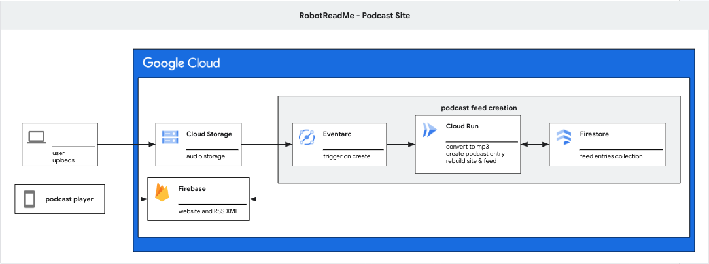

# RobotReadMe: Podcast Site

Create your own custom podcast feed from your own audio files.

Add an audio file (mp3 or wav) to a Google Cloud Storage bucket and a website + a podcast feed (RSS XML) is created.

RobotReadMe - Podcast Site uses Firebase, Google Cloud Storage, Cloud Run and EventArc.


# Setup




## Enable Services

```
gcloud services enable artifactregistry.googleapis.com \
    cloudbuild.googleapis.com \
    eventarc.googleapis.com \
    run.googleapis.com \
    storage.googleapis.com \
    logging.googleapis.com \
    eventarcpublishing.googleapis.com
```

## Set region for services

```
export REGION=us-central1
gcloud config set run/region ${REGION}
gcloud config set run/platform managed
gcloud config set eventarc/location ${REGION}
```

## Create a dedicated service account

```
export PROJECT_ID=$(gcloud info --format='value(config.project)')
export PROJECT_NUMBER=$(gcloud projects describe $PROJECT_ID --format='value(projectNumber)')

export DESC="robot readme podcast feed"
export SA_NAME="sa-robotreadme"
export SA_ID=${SA_NAME}@${PROJECT_ID}.iam.gserviceaccount.com

gcloud iam service-accounts create $SA_NAME --description $DESC --display-name $SA_NAME

# provide roles
gcloud projects add-iam-policy-binding $PROJECT_ID --member="serviceAccount:${SA_ID}" --role "roles/run.invoker"
gcloud projects add-iam-policy-binding $PROJECT_ID --member="serviceAccount:${SA_ID}" --role "roles/eventarc.eventReceiver"
gcloud projects add-iam-policy-binding $PROJECT_ID --member="serviceAccount:${SA_ID}" --role "roles/aiplatform.user" 
gcloud projects add-iam-policy-binding $PROJECT_ID --member="serviceAccount:${SA_ID}" --role "roles/storage.objectCreator"
gcloud projects add-iam-policy-binding $PROJECT_ID --member="serviceAccount:${SA_ID}" --role "roles/storage.objectViewer"
```


## Create a GCS bucket

```
BUCKET_SUFFIX="robotreadme"

gcloud storage buckets create gs://$PROJECT_ID-$BUCKET_SUFFIX/ --location=us-central1
```

# Deploy service

## Deploy service

```
cd service
SERVICE_NAME=robotreadme-podcast
gcloud run deploy $SERVICE_NAME --source . --no-allow-unauthenticated --region $REGION
```

# Create Eventarc trigger

## Cloud Storage service agent permissions
Allow Cloud Storage service agent the proper role for pubsub publishing

```
SERVICE_ACCOUNT="$(gcloud storage service-agent --project=$PROJECT_ID)"

gcloud projects add-iam-policy-binding $PROJECT_ID \
    --member="serviceAccount:${SERVICE_ACCOUNT}" \
    --role='roles/pubsub.publisher'
```

## Create the trigger

```
gcloud eventarc triggers create ${SERVICE_NAME} \
    --destination-run-service=${SERVICE_NAME} \
    --destination-run-region=${REGION} \
    --location=${REGION} \
    --event-filters="type=google.cloud.storage.object.v1.finalized" \
    --event-filters="bucket=$PROJECT_ID-$BUCKET_SUFFIX" \
    --service-account=${SA_ID}
```

## List triggers

```
gcloud eventarc triggers list --location=${REGION}
```

## Create an event by adding to the GCS bucket

An example audio file created by [Fabulae](https://github.com/ghchinoy/fabulae) is included in the `assets` directory.

```
gsutil cp assets/podcast-AudioLMaLanguageModelingApproachtoAudioGeneration_20240928.011505.24.mp3 gs://$PROJECT_ID-$BUCKET_SUFFIX
```


# Documentation

* [Use Eventarc to receive events from Cloud Storage](https://cloud.google.com/run/docs/tutorials/eventarc)
* [Receive direct events from Cloud Storage](https://cloud.google.com/eventarc/docs/run/create-trigger-storage-gcloud)